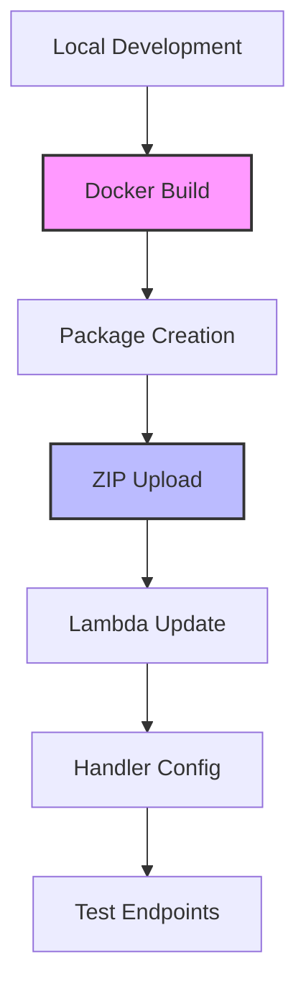

# Meal Planner Implementation Guide

## Table of Contents

1. [Overview](#overview)
2. [Architecture](#architecture)
3. [Deployment Strategy](#deployment-strategy)
4. [Setup Instructions](#setup-instructions)
5. [Related Documentation](#related-documentation)
6. [Troubleshooting](#troubleshooting)
7. [CI/CD Integration](#cicd-integration)
8. [Performance Considerations](#performance-considerations)
9. [Security Best Practices](#security-best-practices)
10. [Monitoring & Observability](#monitoring--observability)
11. [Cost Optimization](#cost-optimization)
12. [Next Steps](#next-steps)

## Overview

This guide provides comprehensive documentation for the Meal Planner application deployment to AWS Lambda. The application uses a hybrid approach where:
- **Serverless Framework** manages AWS infrastructure (Lambda, API Gateway, VPC, IAM)
- **Custom Docker-based scripts** handle application packaging and deployment

This separation ensures predictable deployments with correct Python import paths while leveraging Serverless Framework's infrastructure management capabilities.

### Key Features

- User authentication and authorization
- Recipe creation and management
- Meal planning calendar
- Shopping list generation
- Nutritional tracking
- Responsive web interface

## Architecture

### System Components

```
┌──────────────────────────────────────────────────────────────┐
│                         CloudFront                           │
│                    (CDN - Global Edge)                       │
└──────────────────────────────────────────────────────────────┘
                              │
                    ┌──────────┴──────────┐
                    │                     │
        ┌───────────▼──────────┐   ┌──────────▼──────────────┐
        │    S3 Bucket       │   │   API Gateway      │
        │  (React Static)    │   │   (REST API)       │
        └────────────────────┘   └───────────────────────┘
                                          │
                                ┌──────────▼──────────────┐
                                │   Lambda Function  │
                                │   (Flask API)      │
                                │   ARM64/Graviton2  │
                                └───────────────────────┘
                                          │
                                ┌──────────▼──────────────┐
                                │    RDS Proxy       │
                                │ (Connection Pool)  │
                                └───────────────────────┘
                                          │
                                ┌──────────▼──────────────┐
                                │  RDS Serverless v2 │
                                │   (PostgreSQL)     │
                                └───────────────────────┘
```

### Key Design Decisions

1. **Monorepo Structure**: Frontend and backend in single repository
2. **ARM64 Architecture**: Using Graviton2 for cost efficiency
3. **Custom Packaging**: Docker-based build for Lambda compatibility
4. **RDS Proxy**: Connection pooling for serverless database access
5. **Separate Concerns**: Infrastructure (Serverless) vs Code (custom scripts)

## Deployment Strategy

### Why Hybrid Approach?

The standard Serverless Framework packaging has limitations:
- Preserves local directory structure (`/backend/app/`) in Lambda
- Causes Python import errors (`backend.app` vs `app`)
- Complex layer management
- Unpredictable dependency resolution

Our solution:
- Use Serverless for infrastructure provisioning only
- Custom Docker scripts for application packaging
- Explicit control over package structure and dependencies

### Package Structure Comparison

| Local Development | Lambda Package | Import Path |
|-------------------|----------------|-------------|
| `/backend/app/` | `/app/` | `from app import ...` |
| `/backend/app/models/` | `/app/models/` | `from app.models import ...` |
| `/backend/app/blueprints/` | `/app/blueprints/` | `from app.blueprints import ...` |

### Deployment Process Flow



## Setup Instructions

### Prerequisites

1. **Development Environment**
   - Python 3.11
   - Node.js 18+ and npm
   - Docker Desktop
   - AWS CLI configured
   - Git

2. **AWS Account Setup**
   - IAM user with appropriate permissions
   - S3 bucket for deployments
   - VPC with private subnets for RDS

### Quick Start

```bash
# 1. Clone repository
git clone https://github.com/your-repo/meal-planner-aws-lambda.git
cd meal-planner-aws-lambda

# 2. Install dependencies
npm install --legacy-peer-deps
npm install -g serverless@3

# 3. Deploy infrastructure
serverless deploy --stage test

# 4. Configure security groups
SG_ID=$(aws lambda get-function-configuration \
  --function-name meal-planner-test-app \
  --region us-east-1 \
  --query 'VpcConfig.SecurityGroupIds[0]' \
  --output text)

aws ec2 authorize-security-group-ingress \
  --group-id $SG_ID \
  --protocol tcp \
  --port 5432 \
  --source-group $SG_ID \
  --region us-east-1 2>/dev/null || echo "Rule already exists"

# 5. Deploy application
cd backend/scripts/deployment
./deploy-lambda.sh

# 6. Verify deployment
curl https://your-api-gateway-url/test/health
```

### Environment Configuration

1. **Copy environment template**
   ```bash
   cp .env.example .env
   ```

2. **Configure AWS credentials**
   ```bash
   aws configure
   ```

3. **Set Lambda environment variables**
   - Use Serverless Framework configuration
   - Or AWS Console/CLI

### Directory Structure

```
meal-planner-aws-lambda/
├── backend/
│   ├── app/
│   │   ├── __init__.py          # Flask application factory
│   │   ├── config.py            # Configuration management
│   │   ├── blueprints/          # API endpoints
│   │   ├── models/              # SQLAlchemy models
│   │   ├── schemas/             # Pydantic schemas
│   │   ├── services/            # Business logic
│   │   ├── utils/               # Utilities
│   │   └── requirements.txt     # Python dependencies
│   ├── scripts/
│   │   └── deployment/          # Deployment scripts
│   │       ├── deploy-lambda.sh
│   │       ├── test-local.sh
│   │       └── configure-security.sh
│   └── tests/                   # Backend tests
├── frontend/                    # React application
├── docs/                        # Documentation
│   ├── ImplementationGuide.md  # This file
│   ├── Lambda-Deployment.md
│   ├── Serverless-Setup.md
│   └── RDS-Setup.md
├── serverless.yml              # Infrastructure config
├── package.json                # Node dependencies
└── README.md                   # Project overview
```

## Related Documentation

### Core Documents

1. **[Lambda Deployment](Lambda-Deployment.md)**
   - Detailed Lambda packaging process
   - Docker build configuration
   - Troubleshooting import issues
   - Testing procedures

2. **[Serverless Setup](Serverless-Setup.md)**
   - Infrastructure as Code configuration
   - Plugin configuration
   - Environment management
   - Deployment stages

3. **[RDS Setup](RDS-Setup.md)**
   - Database configuration
   - RDS Proxy setup
   - Security group configuration
   - Connection troubleshooting

4. **[Lambda Troubleshooting](Lambda-Troubleshooting.md)**
   - Common issues and solutions
   - Log analysis
   - Performance optimization
   - Debug procedures

### Quick References

- **[Quick Start Guide](../DEPLOYMENT.md)** - Get up and running quickly
- **[API Documentation](../backend/README.md)** - Backend API reference
- **[Frontend Guide](../frontend/README.md)** - React application setup

## Troubleshooting

### Common Issues

1. **Import Errors in Lambda**
   - **Symptom**: `ModuleNotFoundError: No module named 'app'`
   - **Cause**: Package structure mismatch
   - **Solution**: Use custom deployment script that removes `/backend` prefix

2. **Database Connection Timeout**
   - **Symptom**: Lambda times out after 30 seconds
   - **Cause**: Security group misconfiguration
   - **Solution**: Add ingress rule for port 5432 within same security group

3. **Binary Dependencies Fail**
   - **Symptom**: `ImportError` for psycopg2, cryptography, etc.
   - **Cause**: Mac ARM binaries incompatible with Lambda x86_64
   - **Solution**: Build in Docker with Lambda runtime image

4. **Missing Dependencies**
   - **Symptom**: `ImportError` for werkzeug, flask-pydantic, etc.
   - **Cause**: Incomplete requirements or layer issues
   - **Solution**: Package all dependencies in deployment ZIP

### Debug Commands

```bash
# Check Lambda logs
aws logs tail /aws/lambda/meal-planner-test-app --region us-east-1 --since 5m

# Test Lambda locally
cd backend/scripts/deployment
./test-local.sh

# Verify package contents
unzip -l lambda-package.zip | head -20

# Check security groups
aws ec2 describe-security-groups --group-ids sg-xxxxx --region us-east-1

# Test RDS Proxy connection
aws rds describe-db-proxy-targets --db-proxy-name meal-planner-proxy --region us-east-1
```

## CI/CD Integration

### GitHub Actions Workflow

```yaml
# .github/workflows/deploy.yml
name: Deploy to AWS Lambda

on:
  push:
    branches: [main]
  pull_request:
    branches: [main]

jobs:
  test:
    runs-on: ubuntu-latest
    steps:
      - uses: actions/checkout@v3
      - name: Set up Python
        uses: actions/setup-python@v4
        with:
          python-version: '3.11'
      - name: Run tests
        run: |
          cd backend
          pip install -r app/requirements.txt
          pip install pytest
          pytest tests/

  deploy:
    needs: test
    if: github.ref == 'refs/heads/main'
    runs-on: ubuntu-latest
    steps:
      - uses: actions/checkout@v3
      
      - name: Configure AWS credentials
        uses: aws-actions/configure-aws-credentials@v2
        with:
          aws-access-key-id: ${{ secrets.AWS_ACCESS_KEY_ID }}
          aws-secret-access-key: ${{ secrets.AWS_SECRET_ACCESS_KEY }}
          aws-region: us-east-1
      
      - name: Deploy Lambda
        run: |
          cd backend/scripts/deployment
          ./deploy-lambda.sh
      
      - name: Verify deployment
        run: |
          curl -f https://your-api-gateway-url/test/health || exit 1
```

### Environment Management

| Environment | Branch | API URL | Database |
|-------------|--------|---------|----------|
| Development | develop | dev-api.example.com | dev DB |
| Test | test | test-api.example.com | test DB |
| Production | main | api.example.com | prod DB |

### Deployment Checklist

- [ ] All tests passing
- [ ] Environment variables configured
- [ ] Security groups updated
- [ ] Database migrations run
- [ ] API endpoints tested
- [ ] CloudWatch alarms configured
- [ ] Rollback plan prepared

## Performance Considerations

### Lambda Optimization

1. **Cold Start Mitigation**
   - Use provisioned concurrency for critical endpoints
   - Keep Lambda package size minimal
   - Use ARM64 architecture for better price/performance

2. **Memory Configuration**
   - Start with 512MB for Flask app
   - Monitor and adjust based on CloudWatch metrics
   - Balance memory vs execution time costs

3. **Connection Pooling**
   - RDS Proxy handles connection pooling
   - Configure appropriate max connections
   - Monitor proxy metrics

### Database Optimization

1. **Query Optimization**
   - Use SQLAlchemy eager loading
   - Implement query result caching
   - Add appropriate database indexes

2. **Scaling Configuration**
   - RDS Serverless v2: 0.5-2 ACUs for test
   - Production: 1-8 ACUs with auto-scaling
   - Monitor performance insights

## Security Best Practices

1. **Authentication & Authorization**
   - JWT tokens with appropriate expiration
   - Role-based access control (RBAC)
   - Secure password hashing (bcrypt)

2. **Network Security**
   - Lambda in private VPC subnets
   - Security groups with least privilege
   - RDS Proxy for connection security

3. **Data Protection**
   - Encryption at rest (RDS, S3)
   - Encryption in transit (HTTPS)
   - Sensitive data in Secrets Manager

4. **API Security**
   - Rate limiting at API Gateway
   - Input validation with Pydantic
   - SQL injection prevention via ORM

5. **IAM Policies**

   - **`serverless-cli-user`**: The `serverless-cli-user` is an IAM user with broad permissions, intended for use with the Serverless Framework and other administrative scripts. The policy attached to this user is intentionally permissive to allow for the creation and management of all necessary AWS resources.

     **Warning**: This user has extensive permissions and should be used with caution. The credentials for this user should be stored securely and should not be used for any purpose other than deploying and managing the application.

     ```json
     {
         "Version": "2012-10-17",
         "Statement": [
             {
                 "Effect": "Allow",
                 "Action": "*",
                 "Resource": "*"
             }
         ]
     }
     ```

## Monitoring & Observability

### CloudWatch Configuration

1. **Lambda Metrics**
   - Invocations, errors, duration
   - Concurrent executions
   - Throttles

2. **Custom Metrics**
   - API endpoint latency
   - Database query time
   - Business metrics

3. **Alarms**
   - Error rate > 1%
   - Duration > 5 seconds
   - Throttles > 0

### Logging Strategy

```python
# Structured logging
import json
import logging
from datetime import datetime

logger = logging.getLogger()
logger.setLevel(logging.INFO)

def log_event(event_type, **kwargs):
    logger.info(json.dumps({
        'event': event_type,
        'timestamp': datetime.utcnow().isoformat(),
        **kwargs
    }))
```

## Cost Optimization

### Estimated Monthly Costs (Test Environment)

| Service | Configuration | Est. Cost |
|---------|--------------|-----------|
| Lambda | 100K requests, 512MB | $2 |
| API Gateway | 100K requests | $3.50 |
| RDS Serverless v2 | 0.5-2 ACUs | $50-200 |
| RDS Proxy | 1 proxy | $15 |
| CloudWatch | Logs + Metrics | $5 |
| **Total** | | **$75-225** |

### Cost Saving Tips

1. Use RDS Serverless v2 auto-pause for dev/test
2. Implement caching to reduce database calls
3. Use CloudFront for static content
4. Regular cleanup of CloudWatch logs
5. Reserved capacity for production

## Next Steps

### Immediate Actions
- [ ] Complete database connection testing
- [ ] Implement authentication flow
- [ ] Deploy frontend to S3/CloudFront

### Short Term (1-2 weeks)
- [ ] Complete core API endpoints
- [ ] Implement frontend components
- [ ] Set up CI/CD pipeline
- [ ] Add comprehensive testing

### Medium Term (1 month)
- [ ] Performance optimization
- [ ] Security audit
- [ ] Documentation completion
- [ ] Beta testing

### Long Term
- [ ] Multi-region deployment
- [ ] Advanced features
- [ ] Mobile application
- [ ] Analytics dashboard

---

*Last Updated: August 2024*
*Version: 2.0*
